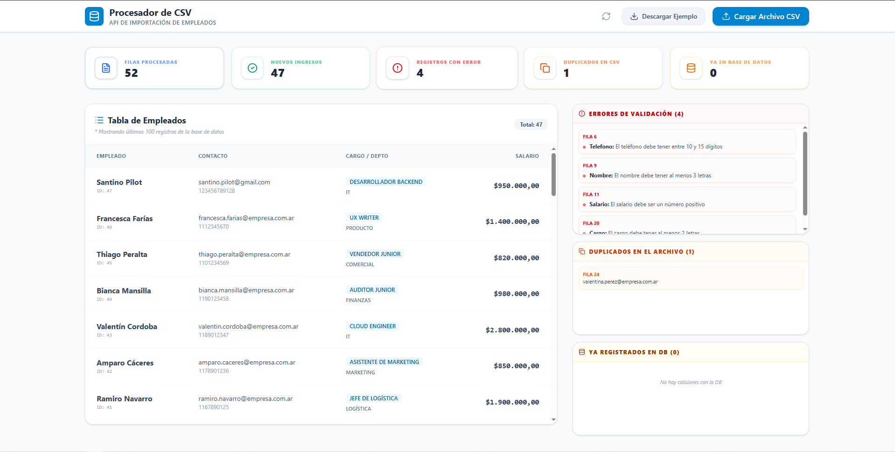

# Procesador de CSV 📊

[](https://nodejs.org/)
[](https://expressjs.com/)
[](https://www.postgresql.org/)
[](https://react.dev/)

Una aplicación web **centrada en el backend** diseñada para la carga, validación y procesamiento eficiente de datos desde archivos CSV. El núcleo del proyecto reside en su arquitectura robusta, seguridad y manejo optimizado de grandes volúmenes de datos.

---

## 🔗 Enlaces del Proyecto (Deploy)
- 🌐 **Frontend:** [Próximamente (Vercel)]()
- ⚙️ **Backend (API):** [Próximamente (Railway)]()

---

## 📸 Vista Previa


---

## 🚀 Arquitectura y Decisiones Técnicas

### 1. Estructura de Proyecto (Backend)
Se ha implementado una arquitectura por capas bien definida para asegurar la escalabilidad:

```text
backend/src/
├── controllers/    # Gestión de peticiones y respuestas HTTP
├── models/         # Consultas SQL y comunicación con la DB
├── services/       # Lógica de negocio core (Batching, Transacciones)
├── middlewares/    # Validaciones (Multer), Rate Limit, Error Handling
├── schemas/        # Validaciones de datos con Zod
├── routes/         # Definición de endpoints
└── utils/          # Funciones auxiliares y formateo
```

### 2. Diseño de Base de Datos
He diseñado un esquema simple pero robusto, con restricciones (`constraints`) para asegurar la calidad de los datos:

```mermaid
erDiagram
    EMPLEADOS {
        bigint id PK
        text nombre
        text apellido
        text email UK "Único para evitar duplicados"
        text telefono
        text cargo
        text departamento
        numeric(10,2) salario
        timestamp created_at
    }
```  


### 3. Integridad con Transacciones Manuales
Se asegura que la importación sea **atómica**. Usando el pool de conexiones de `pg`, envolvemos el proceso en un bloque `BEGIN / COMMIT / ROLLBACK` para garantizar que no existan datos inconsistentes si ocurre un error a mitad de camino.

### 4. Optimización mediante Batching
Para evitar estresar la base de datos con muchas consultas SQL:
- Los datos se procesan en **lotes de 500 registros**.
- Se utiliza una sola consulta SQL dinámica por lote para mejorar el rendimiento.

### 5. Seguridad y Validación
- **Multer:** Middleware de carga configurado en memoria con un límite de **5MB** y validación de tipo MIME.
- **Detección de Duplicados:** Filtro por email tanto en el CSV (en memoria) como en la base de datos.
- **Zod:** Validación estricta de tipos antes de la persistencia.
- **Rate Limiting:** Protección básica contra ataques de fuerza bruta o abuso de la API.

---

## 🛠️ Stack Tecnológico

### Backend (Core Focus)
- **Node.js** & **Express.js**
- **Multer** (Gestión de archivos)
- **PostgreSQL** (Persistencia)
- **Zod** (Validación de esquemas)
- **Vitest** (Unit Testing)

### Frontend
- **React 19**, **Vite**, **Tailwind CSS v4** y **Lucide Icons**

---

## 📋 Documentación de la API

| Método | Endpoint | Descripción |
| :--- | :--- | :--- |
| `POST` | `/empleados/importar` | Sube y procesa un archivo CSV. |
| `GET` | `/empleados/` | Trae todos los empleados de la base de datos. |

---

## ⚙️ Instalación Local

### Pasos
1. **Clonar e instalar Backend y Frontend:**
   ```bash
   git clone <[url-del-repo](https://github.com/santipiloot/procesador-csv)>
   cd backend && npm install # Repetir para frontend
   ```
2. **Configurar Entorno:**
   Crea un archivo `.env` basado en el [**.env.ejemplo**](./backend/.env.ejemplo).
3. **Base de Datos:**
   Ejecuta `schema.sql` en PostgreSQL.
4. **Ejecutar:**
   ```bash
   npm run dev # Backend y Frontend
   ```

---

## 📄 Futuras Mejoras
- **Manejo de Streams:** Para procesar archivos de gigabytes sin saturar la RAM.
- **Autenticación JWT:** Protección de endpoints sensibles.
- **Logs Profesionales:** Implementación de Winston para trazabilidad.
